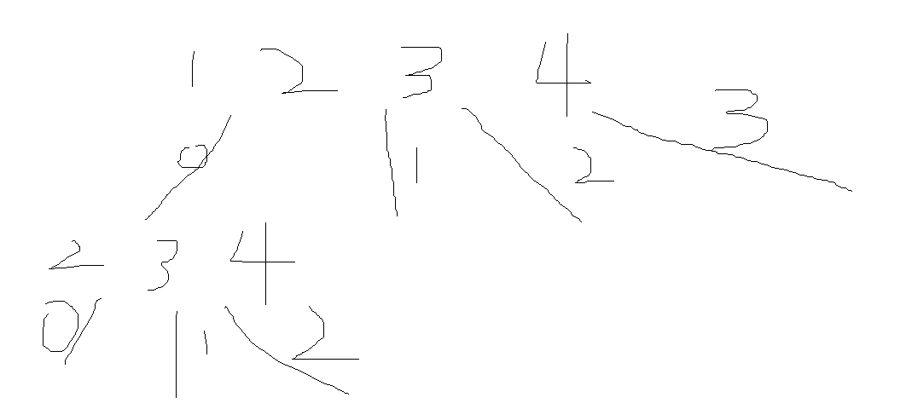

# [NOIP2002 普及组] 选数

## 题目描述

已知 $n$ 个整数 $x_1,x_2,\cdots,x_n$，以及 $1$ 个整数 $k$（$k<n$）。从 $n$ 个整数中任选 $k$ 个整数相加，可分别得到一系列的和。例如当 $n=4$，$k=3$，$4$ 个整数分别为 $3,7,12,19$ 时，可得全部的组合与它们的和为：

$3+7+12=22$

$3+7+19=29$

$7+12+19=38$

$3+12+19=34$

现在，要求你计算出和为素数共有多少种。

例如上例，只有一种的和为素数：$3+7+19=29$。

## 输入格式

第一行两个空格隔开的整数 $n,k$（$1 \le n \le 20$，$k<n$）。

第二行 $n$ 个整数，分别为 $x_1,x_2,\cdots,x_n$（$1 \le x_i \le 5\times 10^6$）。

## 输出格式

输出一个整数，表示种类数。

## 样例 #1

### 样例输入 #1

```
4 3
3 7 12 19
```

### 样例输出 #1

```
1
```

## 提示

**【题目来源】**

NOIP 2002 普及组第二题

# 题解
## 思路：


就是把不同的数依次选中，问题的关键是这个逻辑应该怎么写

```cpp
void dfs(int m, int sum, int startx){//最重要的递归
//m代表现在选择了多少个数
//sum表示当前的和
//startx表示升序排列，以免算重
    if(m == k){//如果选完了的话
        if(isprime(sum))//如果和是素数
            ans++;//ans加一
        return ;
    }
    for(int i = startx; i < n; i++)
        dfs(m + 1, sum + a[i], i + 1);//递归
        //步数要加一，和也要加
        //升序起始值要变成i+1,以免算重
    return ;//这一个步骤下，所有的都枚举完了
    //直接返回去
}
```

他的思路很简洁，根本没有选中进入一个数组，然后再加和、判断之类的方式，核心代码：

```cpp
for(int i=startx;i<n;i++){
    dfs(m+1, sum+a[i], i+1);
}
```

这句话的精妙在于：

+ 直接进行sum加和，没有放置在数组中的冗余操作
+ 利用循环进行选数，下一次循环就会加下一个a[i]
+ startx的设置就是i+1，非常妙

从选数问题得到的启发：

+ 不用维护一个数组，直接加和就可以
+ 传入数值的设置：选了多少、sum是多少、下一个该选谁
+ dfs内部的逻辑：首先判断是否选满，没选满就开一个for继续选数，`dfs(m+1, sum + a[i], i+1)`，由于有一个for在外面包裹，所以一定可以进行树状的选数操作。**实际上这个逻辑中，第一个参数和第三个参数是索引index的方式，与for循环配合可以进行选数操作。**

# 完整代码
```cpp
#include <iostream>
#include <algorithm>
#include <string.h>
#include <vector>
#include <map>
#include <set>
#include <memory>
#include <queue>
#include <math.h>

using namespace std;

const unsigned int N = 5000001;

int num[N];
int num_sum = 0; // sum先置为0
int bu;
int cnt = 0;
int n, k;

bool judge(int num_)
{
    if (num_ <= 3)
    {
        return num_ > 1;
    }
    if (num_ % 6 != 1 && num_ % 6 != 5)
    {
        // 优化：不是6x+1或者6x-1的数，肯定不是质数
        return false;
    }
    int temp = int(sqrt(num_));
    for (int i = 5; i <= temp; i += 6)
    {
        if (num_ % i == 0 || num_ % (i + 2) == 0)
        {
            return false;
        }
    }
    return true;
}

void dfs(int m, int sum, int startx)
{ // 最重要的递归
    // m代表现在选择了多少个数
    // sum表示当前的和
    // startx表示升序排列，以免算重
    if (m == k)
    {                   // 如果选完了的话
        if (judge(sum)) // 如果和是素数
            cnt++;      // ans加一
        return;
    }
    for (int i = startx; i < n; i++)
        dfs(m + 1, sum + num[i], i + 1); // 递归
    // 步数要加一，和也要加
    // 升序起始值要变成i+1,以免算重
    return; // 这一个步骤下，所有的都枚举完了
    // 直接返回去
}

int main()
{

    freopen("in.txt", "r", stdin);
    cin >> n >> k;
    for (int i = 0; i < n; i++)
    {
        cin >> num[i];
    }

    dfs(0, 0, 0);
    cout << cnt << endl;
    return 0;
}
```